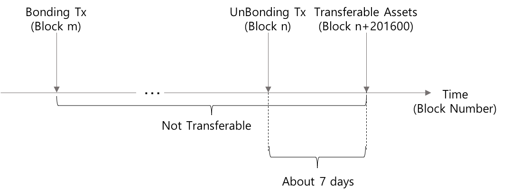

## Simple Summary
블록 합의 및 생성에 직접적(Validator) 또는 간접적(Delegator)으로 참여하기 위하여 자산을 동결(Bonding Tx) 해야 한다. 자산 동결은 현재 가용 자산(Available Assets) 내에서 가능하고, 동결 자산은 동결 처리 Tx (Bonding Tx) 이 기록된 블록에서 부터 즉시 자산 이동이 금지된다.  
동결 자산의 해제는 동결 해제 Tx(Unbonding Tx) 으로 시작된다. 동결 자산 내에서 일부를 동결 해제 할 수 있으며 해제된 자산은 약 7일 이후 부터 자산 이동이 가능해 진다.

## Specification
#### Bonding Assets
자산 동결은 Bonding Tx 을 통해 처리된다. 특정 계정에 대한 Bonding Tx 이 발생되어 블록 B<sub>n</sub> 에 기록 되었다면, 해당 블록 부터 동결된 자산은 이동이 불가능 하다. 동결은 계정이 보유한 가용 자산의 전체 또는 일부에 대하여 이루어질 수 있다.
동일 계정에 대하여 Bonding Tx 과 Common Tx 이 동시에 발생하는 경우, 또 이 두 Tx 에 명시된 자산의 합이 해당 계정의 가용 자산을 초과 할 수 있다. 이 때, 노드별로 어떤 Tx 이 먼저 처리 되느냐에 따라서 각 노드의 ```CheckTx``` 를 통과 한 Tx 집합은 달라지게 될 것이다. 최종적으로 살아 남아 블록에 기록되는 Tx 은 해당 시점에 Proposer 역할을 하는 Validator 노드에서 어떤 Tx 이 살아 남는가에 의하여 결정될 것이다.

#### Unbonding Assets
동결 해제는 Unbonding Tx 을 통해 처리된다. 특정 계정에 대한 Unbonding Tx 은 Bonding Tx 이 처리된 이후 (B<sub>n+1</sub> 부터) 언제라도 발생될 수 있다. Unbonding Tx 이 B<sub>m</sub> 에 기록되었다면, 실제 해당 자산의 이동은 B<sub>m+201600</sub> 부터 가능해 진다.  
X.Blockchain 상에서의 Block 생성 주기를 3초로 계산할 때, 201,600개 블록 생성에는 7일이 소요된다. 즉 Unbonding Tx 이 발생한 시점으로 부터 대략 7일 이후에 실질적인 동결 해제가 완료되어 자산이동이 가능한 상태가 된다.  

<br />
<p align="center">
<br />
<i>Bonding & Unbonding Assets</i>
</p>
<br />

#### Reward & Addional Supply
자산을 동결하여 Validator 의 자격을 취득하게 되면, 동결 자산의 크기에 비례한 보상을 받게 된다. Validator 또는 Delegator 로서 받게 되는 보상은 다음과 같다.

##### Transaction Fees
모든 Tx 은 수수료를 포함하고 있다. 블록에 포함되는 Tx 의 수수료(Fee) 총합은 해당 블록의 Proposer 에게 즉시 지급된다.  
Proposer 으로 선정은 동결 지분량에 비례한 결정론적인 방법으로 이루어진다. 따라서 전체 Tx 수수료 보상분 중 특정 Validator 가 받게될 보상량은 자연스럽게 동결 지분의 크기에 비례하게 되며, 이는 Validator 에게만 지급되는 보상이다.

##### Addional Supply
Tx 수수료 이외에 추가 발행분으로 지급되는 보상이 존재한다. Governace Rules 에 단위 자산당 추가 발행될 자산량이 xto 단위로 명시되어 있다. 블록 합의에 참여한 Validator 와 그에 지분을 위임한 모든 Delegator 들에게 **``{동결 자산량} x {단위 자산당 추가 발행량}``** 만큼 보상이 주어진다.  
이 보상은 바로 해당 계정의 사용 가능한 자산으로 즉시 반영되지 않는다. 자신이 받은 보상을 **요구** 해야 하며, 이 요구가 처리되었을 때 비로소 해당 계정의 사용 가능한 자산으로 반영된다.
