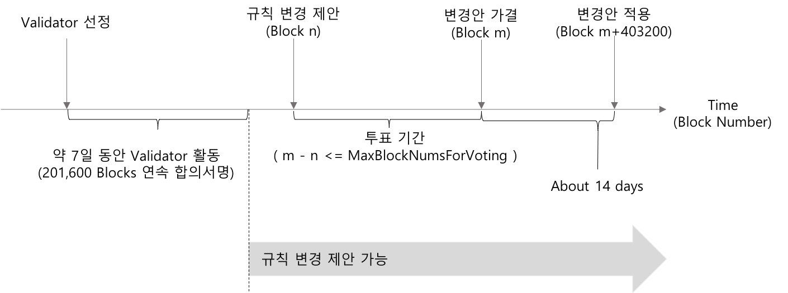

## Simple Summary
X.Blockchain 네트워크의 Validator 중 일정조건을 만족하는 Validator 는 블록체인상의 관리 규칙들에 대한 제안을 할 수 있다. 관리 규칙 변경에 대한 제안은 Transaction 형태로 제출되어 Blockchain 에 기록 된다. 제출된 제안의 적용 여부는 참여자들의 투표로 결정한다.

## Abstract
블록체인의 특성상 참여자들의 동의가 없는 업데이트 특히 합의 규칙과 관련된 사항의 업데이트는 경우에 따라서 Hard Fork 를 유발하여 네트워크가 둘로 나누어지게 되는 결과를 야기한다. 이는 X.Blockchain 의 PoF 를 통한 X.Chain 의 생성 그것과는 다른 문제로서 X.Blockchain Network 자체가 하나 이상이 됨을 의미한다. 또한 참여자들의 '동의' 를 확보하는 과정 자체가 불가능한 일이 되기도 한다.  
이는 블록체인만의 신뢰 확보가 가능토록 하지만 동시에 변화되는 외부 환경에 적응을 힘들게 하는 요인이 되기도 한다.
따라서, 블록체인 규칙 변경을 블록체인 자체의 특성을 이용하여 제안-투표하고 이 결과가 합의 과정에 반영될 수 있는 별개의 또 다른 규칙이 가능하다면, 중앙 집중화된 시스템 구조에서 중앙의 일방적인 업데이트와는 여전히 차이가 있지만 외부 환경의 변화에 적절한 수용과 이를 통한 상대적으로 보다 탄력적인 블록체인 구성 및 운용이 가능할 것이다.

## Specification

#### Governance Rules
X.Blockchain 에서 안건 발의(Proposal)와 투표(Voting)로 변경 가능한 요소는 다음과 같다.  

* **RewardXtoPerCoin** : 블록 생성시 새로 발행되어 주어지는 보상량. 블록 합의에 참여하기 위하여 동결된 자산의 1코인(1018xto) 당 지급되는 보상량을 xto 단위로 명시한 값이다. (1Coin = 1018xto)
* **MinCommonTxFee** : Tx. 이 처리되기 위한 최소 수수료. 이 값보다 큰 수수료를 지불하는 Tx. 중 높은 수수료를 지불하는 Tx. 이 먼저 처리될 것이다. 반면에 이 값 보다 작은 수수료를 지불하는 Tx. 은 처리 되지 않을 뿐만 아니라 주변 노드로 전파도 이루어지지 않는다.  
이 값은 모든 Tx. 에 대하여 동일하지 않고 종류별로 다른 값으로 지정된다.
* **MinBondingTxFee** : TxBonding 에 대한 최소 수수료.
* **MinGRProposalTxFee** : TXGRProposal 에 대한 최소 수수료.
* **MinGRVotingTxFee** : TXGRVoting 에 대한 최소 수수료.
* **MinXTxFee** : TXChain 에 대한 최소 수수료.
* **MaxBlockNumsForVoting** : 최대 투표 기간 블록 수.
* **MinBlockNumsToGRProposal** : 규칙 변경을 제안할 수 있는 자격은 Validator 로서 연속적으로 서명한 블록 수로 결정된다. 이 값보다 많은 블록에 대하여 연속적으로 서명한 Validator 만 자격을 갖는다.
* **MinBlockNumsUtilReflection** : 투표가 제안된 블록 부터 가결된 제안사항이 적용되기 시작하는 블록까지의 최소 블록 수.
* **MaxBlockNumsUtilReflection** : 투표가 제안된 블록 부터 가결된 제안 사항이 적용되기 시작하는 블록까지의 최대 블록 수.
* **BlockNumsFreezingValidator** : 이 값에 정의된 블록 수 만큼 블록 생산 및 합의 과정에 연속적으로 불참하는 Validator는 Validator Set 에서 제외되고 다른 후보 노드가 Validator 역할을 대신하게 될 것이다.
* **BlockNumsUtilUnbonded** : Bonding 된 자산을 다시 사용하기 위해서는 동결해제 요청을 한 시점에서 부터 실제 자산 이동이 가능한 상태가 되기 까지의 블록 수.
* **MaxDelegatableValidatorNumbers** : 하나의 계정이 위임 할 수 있는 최대 Validator 수.
* **ValidatorNums** : Validator Set 을 구성하는 Validator의 수.
* **FirstCompatibleVersion** : 블록체인에 참여하기 위한 X.Blockchain 노드 프로그램의 최소 버전. 이 값보다 작은 버전의 노드 프로그램과의 네트워크 연결은 제한된다.

#### Proposal

규칙 변경은 TxProposeGRPayloadBody 를 포함한 Tx 을 발생 시킴으로서 시작된다. 규칙 변경 제안 자격은 최근 **N**개 블록의 생성에 참여하고 현재 Tx. 처리 시점에서도 Validator 자격을 유지하는 계정에게 주어진다. 여기서 **N**은 **MinBlockNumsToGRProposal** 의 값을 의미한다.  

#### Vote
제안된 규칙 변경안에 대한 투표인단은, 해당 제안 사항을 담은 블록 생성 시점의 Validators 이다. 예를 들어 TxGRProposalPayloadBody 를 포함하는 트랜잭션이 블록 Bn 에 기록되었다면, 블록 Bn 생성 시점의 Validators 가 투표인단이 되고, 변경안 가결 여부 판단의 기준이 되는 지분 역시 이 시점의 지분으로 계산된다.  
해당 시점 투표인단 지분의 2/3 초과가 찬성하는 경우 해당 제안은 가결되어 정해진 시점에 반영 되어질 것이다.

#### Apply
제안 사항이 블록 Bm에서 가결 되었다면  Bm+403200 부터 적용된다. 블록 생성 주기를 3초로 하였을 때 403,200 개 블록 생성에는 14일이 걸린다.  

 

 
<i>Governance Rules 제안 - 투표 - 적용 절차</i>

